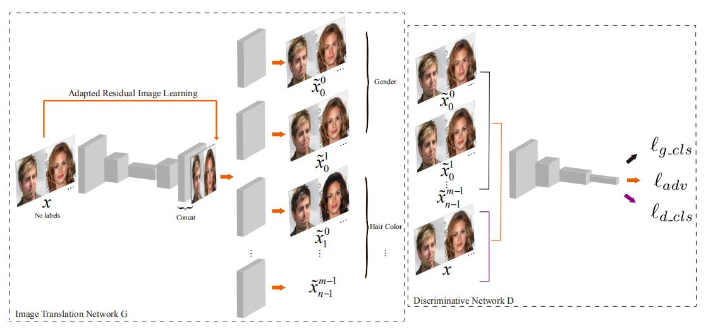

# SG_GAN_tensorflow
The code of paper "Sparsely Grouped Multi-task Generative Adversarial Networks for Facial Attribute Manipulation"

## Paper
[Sparsely Grouped Multi-task Generative Adversarial Networks for Facial Attribute Manipulation](https://arxiv.org/abs/1805.07509) 

Introduction: Recently, Image-to-Image Translation (IIT) has made great progress in enabling image style transfer and manipulation of semantic context in an image. However, existing approaches require exhaustive labelling of training data, which is labor demanding, difficult to scale up, and hard to adapt to a new domain. To overcome such a key limitation, we propose sparsely grouped generative adversarial networks(SG-GAN), a novel approach that can perform image translation in the sparsely grouped datasets, which most training data are mixed and just a few are labelled. SG-GAN with one-input multiple output architecture can be used for the translations among multiple groups using only a single trained model. As a case study for experimentally validating the advantages of our model, we apply the algorithm to tackle a series of tasks of attribute manipulation for facial images. Experiment results show that SG-GAN can achieve competitive results compared with previous state-of-the-art methods on adequately labelled datasets while attaining the superior quality of image translation results on sparsely grouped datasets where most data is mixed and only small parts are labelled. 

