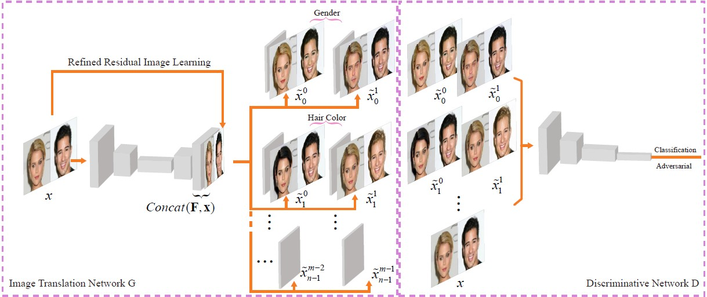
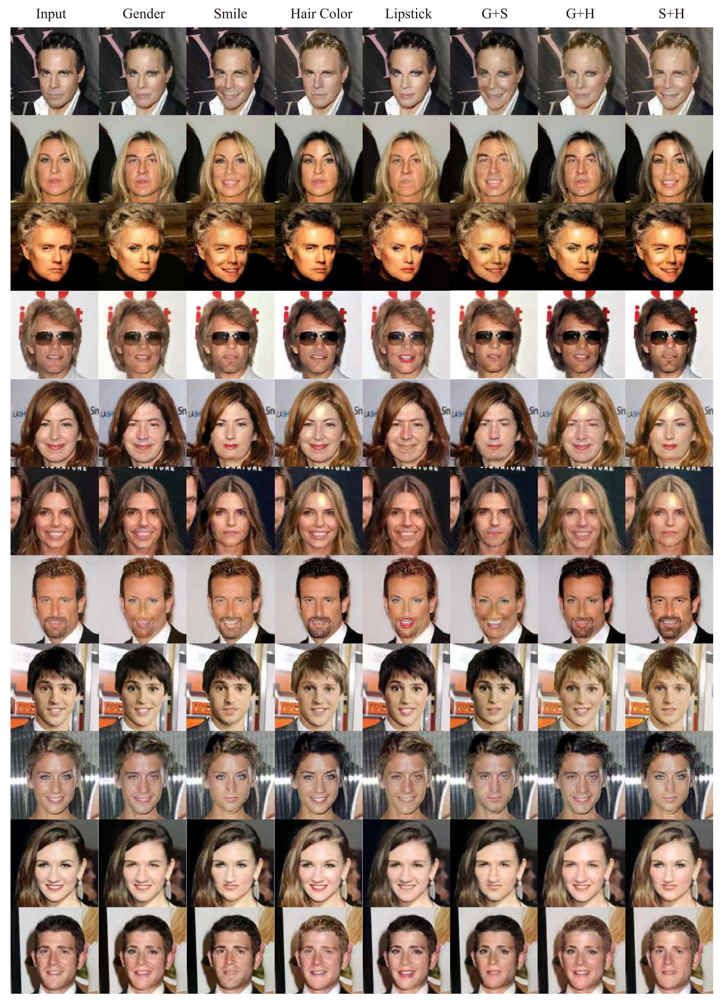

## SGGAN - Official Tensorflow Implementation

<p align="center"></p>

> **Sparsely Grouped Multi-task Generative Adversarial Networks for Facial Attribute Manipulation**<br>
> Jichao Zhang, Yezhi Shu, [Songhua Xu](https://scholar.google.com/citations?user=hVDwM04AAAAJ&hl=en), [Gongze Cao](https://zardinality.github.io/), [Fan Zhong](http://irc.cs.sdu.edu.cn/info/1007/1365.htm), [Meng Liu](https://scholar.google.com/citations?user=tI_cTV8AAAAJ&hl=en), [Xueying Qin](http://irc.cs.sdu.edu.cn/info/1030/1371.htm)<br>
> In ACMMM 2018 Oral.<br>

> Paper: https://arxiv.org/abs/1805.07509<br>

> **Abstract:** *Recently, Image-to-Image Translation (IIT) has made great progress in enabling image style transfer and manipulation of semantic context in an image. However, existing approaches require exhaustive labelling of training data, which is labor demanding, difficult to scale up, and hard to adapt to a new domain. To overcome such a key limitation, we propose sparsely grouped generative adversarial networks(SG-GAN), a novel approach that can perform image translation in the sparsely grouped datasets, which most training data are mixed and just a few are labelled. SG-GAN with one-input multiple output architecture can be used for the translations among multiple groups using only a single trained model. As a case study for experimentally validating the advantages of our model, we apply the algorithm to tackle a series of tasks of attribute manipulation for facial images. Experiment results show that SG-GAN can achieve competitive results compared with previous state-of-the-art methods on adequately labelled datasets while attaining the superior quality of image translation results on sparsely grouped datasets where most data is mixed and only small parts are labelled..*

### Citation

```
@inproceedings{zhang2018sparsely,
  title={Sparsely grouped multi-task generative adversarial networks for facial attribute manipulation},
  author={Zhang, Jichao and Shu, Yezhi and Xu, Songhua and Cao, Gongze and Zhong, Fan and Liu, Meng and Qin, Xueying},
  booktitle={Proceedings of the 26th ACM international conference on Multimedia},
  pages={392--401},
  year={2018}
}
```

## Dependencies
* [Python 2.7](https://www.python.org/download/releases/2.7/)
* [Tensorflow 1.4+](https://github.com/tensorflow/tensorflow)

## Usage

- Clone this repo:
```bash
git clone https://github.com/zhangqianhui/Sparsely-Grouped-GAN.git
cd Sparsely-Grouped-GAN

```
- Download the CelebA dataset

You can download the [CelebA dataset](aligned & cropped)(https://www.dropbox.com/sh/8oqt9vytwxb3s4r/AAB06FXaQRUNtjW9ntaoPGvCa?dl=0) 
and unzip CelebA into a directory. 

 Just like
 
 ~~~
---------------------------------------------

The training data folder should look like : 
<base_dir/celebA/>
                |--image1
                |--image2
                |--image3
                |--image4...
    
list_attr_celeba.txt

---------------------------------------------
~~~

- Train the model using the default parameter
```bash
python main.py 
```
- Test the model by changing OPER_FLAG in config.py from 0 to 1.
```bash
python main.py 
```

## Experiment Result 

lign="center"></p>

## Reference code

- [StarGAN Pytorch](https://github.com/yunjey/StarGAN)

- [GeneGAN tensorflow](https://github.com/Prinsphield/GeneGAN)

- [DCGAN tensorflow](https://github.com/carpedm20/DCGAN-tensorflow)

- [Spectral Norm tensorflow](https://github.com/taki0112/Spectral_Normalization-Tensorflow)
